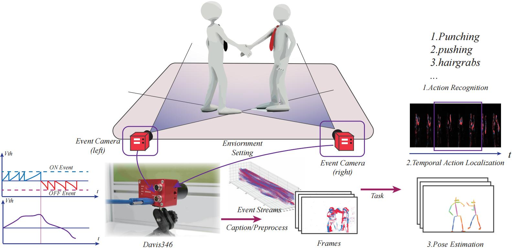
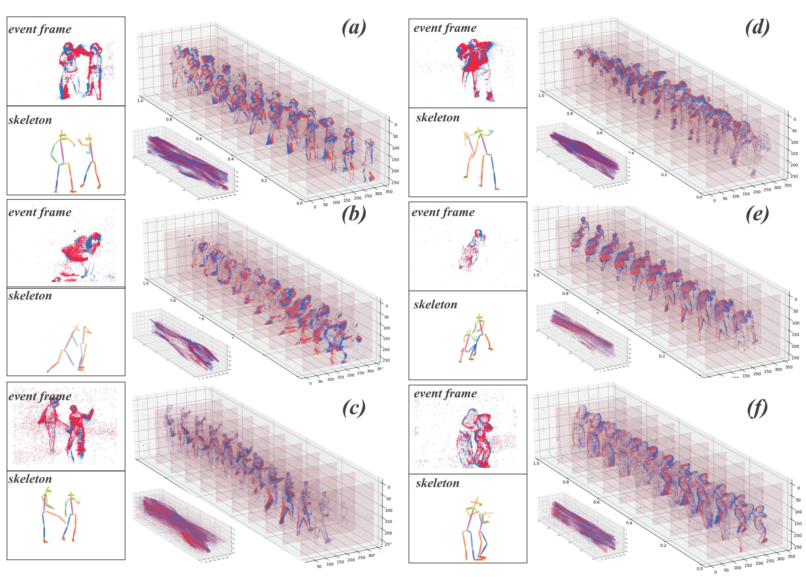

# Bullying10K
Bullying10k:
A Neuromorphic Dataset towards
Privacy-Preserving Bullying Recognition.

Bullying10K is a privacy-preserving dataset designed for bullying detection. It was captured using a DVS (Dynamic Vision Sensor) camera and includes 10,000 samples, comprising a total of 12 billion events. The dataset is released under Creative Commons Attribution 4.0 license.

## Data Access
We have released our dataset and in order to ensure its long-term preservation, we have uploaded it to the Figshare website. Figshare is a dedicated public platform for storing data. It is available on the website https://figshare.com/articles/dataset/Bullying10k/19160663 
or using DOI  https://doi.org/10.6084/m9.figshare.19160663.

Also, we provide another link of baidu cloud drive to access to the data. https://pan.baidu.com/s/1AHQKqEPlkvbg4es2lAYcZQ?pwd=2hoy

You can also visit our website for more detailed information. https://www.brain-cog.network/dataset/Bullying10k/ 

## Examples

